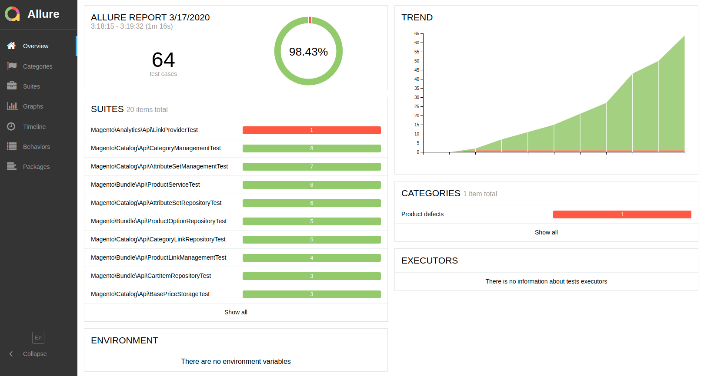

# Allure Reporting

[Allure](http://allure.qatools.ru/) is a powerful **test reporting framework**. It is fully compatible with [PHPUnit](https://phpunit.de/) and  [Codeception](https://codeception.com/). This means that each type of test available in **Magento 2** can be visualized.

## Configuration

To enable Allure in your project environment, add to your `.env` file:

```
REWARD_ALLURE=1
```

As a result both `php-fpm` and `php-debug` containers get additional mount `/var/allure-results` where the Test results should be saved.

### PHPUnit Reports

To visualize your PHPUnit Tests results *(Unit, Integration, API functional, Static)* in Allure, you need to edit `phpunit.xml` file and find `<listeners>` section. If you have `<listener class="Yandex\Allure\Adapter\AllureAdapter">` node, just change the path where logs are saved: `<string>/var/allure-results</string>` (please notice leading `/`).

```xml
    <listeners>
        <listener class="Magento\TestFramework\Event\PhpUnit"/>
        <listener class="Yandex\Allure\Adapter\AllureAdapter">
            <arguments>
                <string>/var/allure-results</string>
                ...
```

### Codeception Reports

Adjusting Codeception reports path is a little bit more complicated. Please find the `dev/tests/acceptance/codeception.yml` file, under `Magento\FunctionalTestingFramework\Allure\Adapter\MagentoAllureAdapter` you'll find `outputDirectory`. Change it's value to `/var/allure-results`.

```yaml
extensions:
    config:
        Magento\FunctionalTestingFramework\Allure\Adapter\MagentoAllureAdapter:
            deletePreviousResults: false
            outputDirectory: /var/allure-results
```

## Web Interface

Allure reports are available with your Web Browser on `allure` subdomain (eg. `https://allure.magento2.test/`). Reports are generated with 5 seconds interval.


