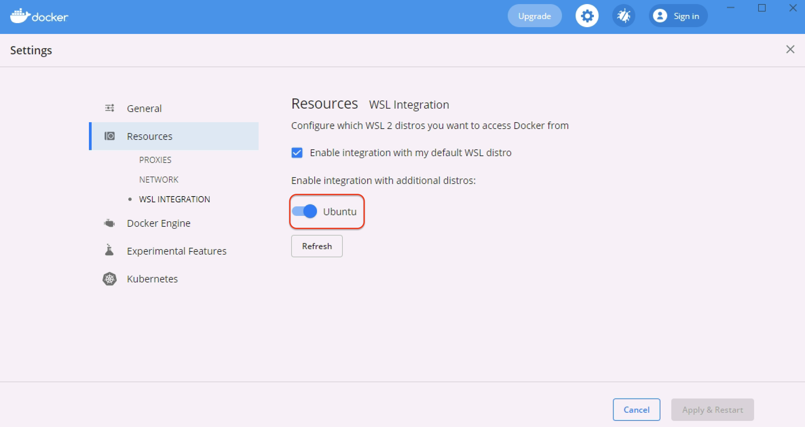

## WSL and WSL2 Support

On Windows, by default, Reward uses file synchronization method with Mutagen instead of direct mounting.
It is possible to enable direct mounting for WSL2. WSL2 provides better performance for Filesystem mounts if they are in the WSL filesystem.

Under the hood Windows runs a lightweight Virtual Machine and using Bash for Ubuntu for Windows you will get your root from this filesystem.
If you choose to develop from under this filesystem you will get really great performance for your mounts.

The caveat is you'll have to reach this filesystem somehow from your IDE.

``` warning::
    It's pretty important to understand in this case the files you are reaching from WSL2 are inside a Virtual Machine.

    That's the reason why they are blazing fast in docker, because they can be directly mounted to docker just as on a Linux machine.
```

Further reading:

* [Explanation on Architecture in WSL2](https://devblogs.microsoft.com/commandline/announcing-wsl-2/#a-quick-explanation-of-the-architectural-changes-in-wsl-2)

* [Docker Desktop WSL 2 backend](https://docs.docker.com/docker-for-windows/wsl/)

### Enable WSL 2 on Windows 10

1. To install WSL2, enable WSL and VirtualMachinePlatform Windows features in an elevated Powershell prompt

    ```
    dism.exe /online /enable-feature /featurename:Microsoft-Windows-Subsystem-Linux /all /norestart

    dism.exe /online /enable-feature /featurename:VirtualMachinePlatform /all /norestart
    ```

2. Then install the new version of Microsoft's Linux kernel

    [WSL Update](https://wslstorestorage.blob.core.windows.net/wslblob/wsl_update_x64.msi)

3. Change default WSL version of the system to WSL2
    ```
    wsl --set-default-version 2
    ```

4. Install the preferred Linux Distribution from Microsoft Store

5. Check WSL versions of the distros on the system

    ```
    wsl --list --version
    ```

6. Convert distributions to WSL 2

    ```
    wsl --set-version <distribution name> <versionNumber>

    # example:
    wsl --set-version Ubuntu 2
    ```

[Install WSL2 on Windows 10](https://docs.microsoft.com/en-us/windows/wsl/install-win10)

``` warning::
    **Beware of your Distro's package managers!**
    Please make sure you are using Windows' Docker's WSL integration.

    **You should not install Docker with Ubuntu's package manager inside your Bash for Ubuntu for Windows!**
```

### Using WSL2 with Reward

To use Reward with WSL2 there are two possible options:

1. Use Reward's Windows binary and enable **wsl2-direct-mount** option

2. Use Reward's Native Linux binary and trick Reward to think it's running on a Linux host

#### Using WSL2 Direct Mount option

To enable WSL2 support in Reward you can use `--wsl2-direct-mount` command line flag or to make it persistent, you can
enable the following setting in your reward config `~/.reward.yml`.

```
reward_wsl2_direct_mount: 1
```

#### Using Linux native binary

In this case you will just have to download and install the Linux installation method and install Reward as if you would
do in a Linux machine.

``` warning::
    If you choose to use the Reward linux binary on Windows the ``reward install`` command **will not install** the
    root CA certificate to your Windows Trusted Root CA Store.

    To do this, you will have to import it manually.

    * Start > Run > MMC
    * File > Add / Remove Snap In
    * Double Click on ``Certificates``
    * Select Computer Account
    * Local Computer > Finish
    * Open Trusted Root Certification Authorities > Certificates (Local Computer)
    * Right Click on the Store > All tasks > Import
    * Next, next and select the browse button
    * On the appearing window's address bar type ``\\wsl$``
    * Enable showing of all filetypes
    * Go to Ubuntu > home > username > .reward > ssl > rootca > certs
    * Select the ``ca.cert.pem`` and import it
```

### Reaching WSL2 filesystem in Windows

Open File Explorer and type `\\wsl$` to the address bar.

**Visual Studio Code** also offers a WSL2 extension for this problem.

* [WSL 2 with Visual Studio Code](https://code.visualstudio.com/blogs/2019/09/03/wsl2)

``` warning::
    You should only use this for directories which are inside your WSL2 filesystem or mounted to WSL2 filesystem.
```

* [Get started mounting a Linux disk in WSL 2 ](https://docs.microsoft.com/en-us/windows/wsl/wsl2-mount-disk)

``` note::
    If you encounter the following error:

    .. code::

        Cannot create container for service php-fpm:
        failed with: can't access specified distro mount service:
        stat /run/guest-services/distro-services/ubuntu.sock: no such file or directory

    Possible Solution: check your Windows Docker Settings and under the Resources -> WSL INTEGRATION tab
    and make sure docker integration is enabled for the distro you are using.
```



### Reward config file overlapping in WSL/Windows (only when you are using Windows binary)

``` note::
    Even when you are running Reward's Windows binary inside WSL2 it will not use WSL2's home directory as your user's and the application's HOME.
    That's because of GO's behaviour on determining the User's HOME. On Windows it will still be your Windows User's HOME directory.

    To change Reward's default config file you can use the ``--config`` flag.

    Similarly Composer's home directory (~/.composer) will be mounted from Windows User's home directory.

    To change it you can add ``reward_composer_dir`` variable to your Reward configuration and set a value from WSL's filesystem.
```
